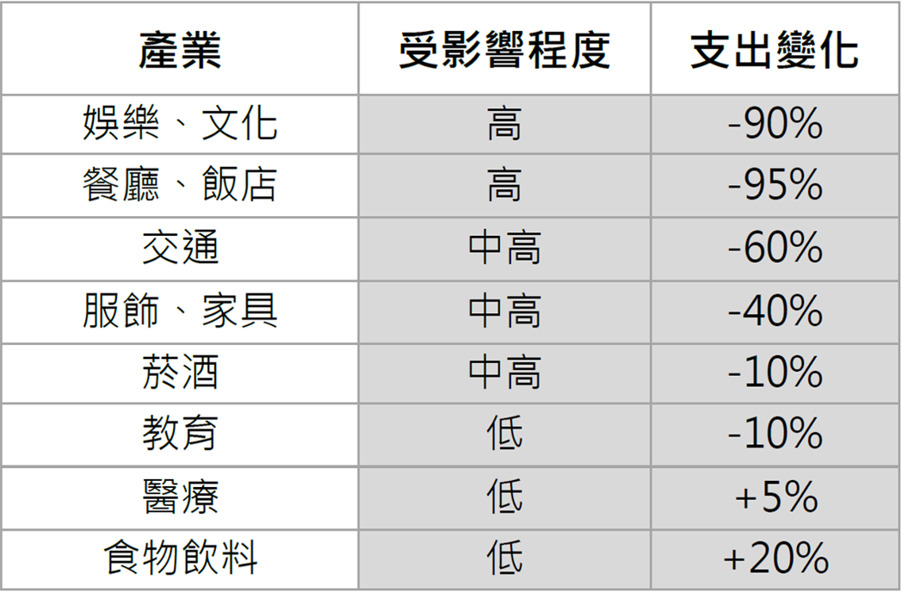

# 新冠疫情成全通路(店面/電商)轉型分水嶺

截至目前新冠肺炎全球確診數已突破三千萬到 3,080萬例，死亡人數已超過 95.7 萬人，並且趨勢並未減緩。疫情影響下，大家盡量減少前往實體店購物，連帶使宅經濟發威。中國的阿里巴巴、京東等電商公司，以及台灣的 PChome、momo 都於本波中受益，聯合伯恩斯坦公司（Alliance Bernstein）的分析師便認為「當前的狀況非常適合電子商務的增長」。

而在此波疫情中，各產業受影響的範疇比例也有結構差異，娛樂文化受創最高，服飾家具次之。
後續在完全解封后，消費者口袋裡的每一塊錢該如何分配(產業/通路)的消費新趨勢，將值得密切重點觀察。

註：參考國泰銀行調查-消費內容解密：娛樂及餐廳大減，教育及醫療幾乎未受影響
(https://www.cathayconsult.com.tw/market/fund-topic/38259)
